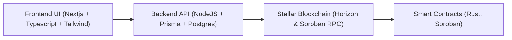

# Stellar DeFi Lending & Borrowing Protocol

## Overview

The Stellar DeFi Lending & Borrowing Protocol is a decentralized finance (DeFi) platform built on the Stellar blockchain using Soroban smart contracts. This platform is designed to enable fast, secure, and low-cost lending and borrowing services, providing an accessible alternative to traditional financial systems.

## Problem Statement

Traditional financial systems suffer from:
- **High Fees & Delays:** Transaction costs and processing times are often excessive.
- **Limited Accessibility:** Many underserved or underbanked populations lack access to reliable credit.
- **Centralized Control:** Central intermediaries can lead to inefficiencies, opacity, and risk of manipulation.
- **Inefficient Risk Management:** Traditional collateral and liquidation methods can be slow and inflexible.

Our solution leverages Stellar’s low fees and fast settlement times along with Soroban’s smart contract capabilities to create a transparent, efficient, and decentralized lending protocol that:
- Reduces costs and speeds up transactions.
- Provides global access to financial services.
- Automates collateral management and risk controls using on-chain logic.
- Empowers users with full custody and transparent operations.

## Key Features

### Smart Contract Layer (On-Chain)
- **Core Functions:** Deposit collateral, borrow, repay, withdraw, and liquidate positions.
- **Development:** Written in Rust using the Soroban SDK.
- **Dynamic Collateral Management:** Integrates off-chain price oracles to update collateral valuations in real time.
- **Event Logging:** Emits events for key transactions (deposits, withdrawals, borrows, liquidations).

### Backend API Layer (Off-Chain)
- **API Endpoints:** REST/GraphQL interfaces for frontend communication.
- **Blockchain Integration:** Connects to Stellar’s Horizon and Soroban RPC endpoints for transaction submission and monitoring.
- **Data Indexing & Caching:** Stores smart contract events for real-time dashboards and analytics.
- **Oracles Integration:** Fetches external price data to support dynamic protocol adjustments.

### Frontend User Interface
- **User Experience:** Modern UI (built with React, Vue, or Angular) for seamless interactions.
- **Wallet Integration:** Supports Stellar wallet connections (e.g., Freighter, Albedo) for secure transaction signing.
- **Dashboard:** Real-time display of account balances, loan statuses, collateral ratios, and interest accrual.
- **Interactive Actions:** Simple forms to deposit, borrow, repay, and withdraw assets.
- **Notifications:** Real-time alerts for important events (e.g., liquidation warnings).

## Technical Architecture

## Roadmap

**Q1 2025: Research & Planning**
- Conduct detailed market research and finalize project requirements.
- Design system architecture and draft initial smart contract specifications.

**Q2 2025: Core Development**
- Develop and test core smart contracts using Soroban.
- Build the backend API for seamless blockchain interaction.
- Integrate off-chain price oracles for dynamic collateral and risk management.

**Q3 2025: Frontend Development & Beta Testing**
- Create a user-friendly frontend with wallet integration and real-time dashboards.
- Launch a closed beta to gather community feedback and iterate on UX/UI.

**Q4 2025: Security Audits & Mainnet Launch**
- Perform comprehensive security audits and code reviews.
- Optimize performance and scalability.
- Officially launch the platform on Stellar’s mainnet and initiate community outreach.
